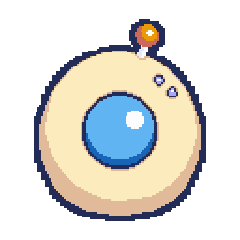
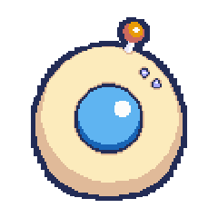

# cube — Claude Code Status auf GeekMagic SmallTV-Ultra

Verwandelt einen [GeekMagic SmallTV-Ultra](https://github.com/GeekMagicClock/smalltv-ultra)
(ESP8266, 1.5" IPS, 240×240) in ein Live-Status-Display für Claude Code:

| Claude-Hook | Cube zeigt | Auto-Revert | peon-ping Kategorie |
|---|---|---|---|
| `SessionStart` | `done.gif` (visueller Alias, eigener State-Label fürs Routing) | 5 s → idle | `session.start` |
| `UserPromptSubmit` (Prompt rein, denkt) | `thinking.gif` | — | `task.acknowledge` |
| `Stop` (Antwort fertig) | `done.gif` | 5 s → idle | `task.complete` |
| `Notification` | `alert.gif` | 5 s → prev_state | (varies) |
| `PermissionRequest` | `permission.gif` (waifu) / `alert.gif` (orb) | 5 s → prev_state | `input.required` |
| `PostToolUseFailure` (Bash) | `error.gif` (waifu) / `alert.gif` (orb) | 5 s → prev_state | `task.error` |
| `PreCompact` (Kontext voll) | `compact.gif` (waifu) / `alert.gif` (orb) | 5 s → prev_state | `resource.limit` |
| `SessionEnd` | (Session-Eviction) | — | (cleanup) |

`prev_state` = letzter stabiler State der Session (`thinking` oder `idle`),
sodass ein Bash-Fail während `thinking` zurück auf `thinking` revertet, nicht
auf `idle`. `done`/`start` revertieren immer auf `idle` (Task-Ende /
Session-Greeting). Wer `permission` lieber forever bis User-Reaktion will:
`CUBE_PERMISSION_REVERT=0`. Hooks-Set spiegelt 1:1 das von
[peon-ping](https://github.com/) (Audio-Sibling), so dass Cube und Sound im
Gleichschritt feuern.

### Skin-Preview

| Skin | thinking | alert | idle | done |
|---|:---:|:---:|:---:|:---:|
| **orb** |  |  |  |  |
| **waifu** |  |  |  |  |

Waifu hat zusätzlich dedizierte `permission` / `error` / `compact` GIFs (orb
fällt für diese States auf `alert.gif` zurück):

| Skin | permission | error | compact |
|---|:---:|:---:|:---:|
| **waifu** |  |  |  |

`cube.sh skin <orb|waifu>` schaltet zwischen den Sets. Files für beide Skins
liegen parallel auf dem Cube; gewählt wird client-seitig in `cube.sh`. Lokal
trennen die Quellen sich in `assets/<skin>/<state>.gif` — beim Upload
übersetzt `upload.sh` auf die flache Cube-Konvention (`<state>.gif` für orb,
`<skin>_<state>.gif` sonst), da die Firmware in `/image/` keine Subdirs
navigiert.

Pixel-Art generiert per [PixelLab.ai](https://www.pixellab.ai), per-Skin
Prompts in `prompts/<skin>-skin.md`, zusätzlich Sat-15 / Con+45 / Sharp+50
Post-Process via `bin/contrast-fix.py` zur Rettung der 1-2px Wimpern/Brauen
durch Cube-Quantize.

## Funktionsweise

Claude Code feuert Hooks (`SessionStart/End`, `UserPromptSubmit`, `Stop`, `Notification`,
`PermissionRequest`, `PostToolUseFailure`, `PreCompact`). Jeder Hook ruft
`cube.sh <state>` auf, welches per HTTP `GET /set?img=/image/<state>.gif` das
passende GIF anzeigt. Non-blocking: bei toter Cube läuft Claude unverändert
weiter (2s curl-Timeout + `exit 0`).

**Multi-Session-aware:** Cube.sh liest `session_id` aus dem Hook-Stdin-JSON
(via `jq`) und tracked Zustand **pro Session** in `/tmp/.cube-sessions-$UID.json`.
Bei mehreren parallelen Claude-Sessions wird der Display-Zustand per Priorität
aggregiert: `permission > error > compact > done > thinking > alert > start > idle`. Beispiel:
Session A denkt, Session B beendet — Cube bleibt auf `thinking`. Session A
beendet → Cube auf `idle`. Stale Sessions (>1 h kein Update) werden geprunet.
Auto-Revert ist TOCTOU-sicher via Per-Session Seq-Counter.

```
┌─────────────────────────┐  GET /set?img=...   ┌──────────────────────┐
│ Claude Code Hook        │ ──────────────────► │ SmallTV-Ultra        │
│ ~/.claude/settings.json │                     │ $CUBE_IP             │
└──────────┬──────────────┘                     │ Theme 3 (Photo Album)│
           │ executes                           │ Plays /image/X.gif   │
           ▼                                    └──────────────────────┘
  ~/.claude/bin/cube.sh
```

## Projektstruktur

```
cube/
├── README.md             ← du bist hier
├── Makefile              ← Top-Level Targets (resize, upload, deploy, cycle, dev-install)
├── bin/
│   ├── cube.sh           ← Haupt-CLI (wird nach ~/.claude/bin/ deployed)
│   ├── cube-gen.py       ← Pillow-Placeholder-Generator (optional)
│   ├── resize.sh         ← 128/256 → 240×240 via gifsicle, per-skin
│   ├── upload.sh         ← POST GIFs an Cube /doUpload, prefix-translation
│   ├── contrast-fix.py   ← Pillow Sat/Con/Sharp pro Frame (Brauen-Rescue)
│   ├── cube-watchdog.sh  ← Polling-Daemon, redisplay nach Cube-Reboot
│   ├── cube-watchdog.service ← systemd --user Unit (optional)
│   ├── mock-cube.py      ← Stdlib HTTP-Server, mimics cube für Dev ohne Hardware
│   ├── mock-cube.service ← systemd --user Unit für mock-cube
│   ├── cube-overlay.py   ← Frameless Tk-Window (WSLg), spiegelt mock-cube auf Desktop
│   ├── cube-overlay.service ← systemd --user Unit für overlay
│   ├── win/
│   │   ├── cube-overlay-win.pyw       ← Windows-natives Overlay (CPython+Tk, WSLg-frei)
│   │   ├── cube-overlay-win.cmd       ← Autostart-Wrapper (Startup-Folder)
│   │   ├── cube-overlay-win-html.pyw  ← HTML/WebView2-Variante (pywebview, Mochi Classic)
│   │   ├── cube-overlay-win-html.cmd  ← Autostart-Wrapper für HTML-Variante
│   │   ├── cube-overlay-win-html.ps1  ← PowerShell-Variante
│   │   ├── html/                       ← index.html + overlay.css + overlay.js (inlined at start)
│   │   └── README.md                  ← Setup für Windows-Host
│   ├── deploy.sh         ← Sync bin/* → ~/.claude/bin/ + systemd-Units
│   ├── cycle.sh          ← Visueller Smoke-Test
│   └── clear-old.sh      ← Räumt Cube auf (Dry-run + --force)
├── assets/
│   ├── orb/              ← orb-skin source GIFs (thinking/alert/idle/done)
│   ├── waifu/            ← waifu-skin source GIFs (alle 7 states; `start` ist visueller Alias auf done.gif)
│   ├── desktop/          ← optionale hi-res Overrides nur für Overlay
│   │   └── <skin>/       ← 256×256, 7-16 Frames, kein Quantize-Limit (cube-pipeline skippt diesen Dir)
│   └── 240/
│       ├── orb/          ← orb 240×240 hochskaliert
│       └── waifu/        ← waifu 240×240 hochskaliert
└── prompts/
    ├── 00-style-guide.md ← orb-Maskottchen-Design + Palette
    ├── 01-thinking.md    ← Asset-Prompts für thinking-Animation (orb)
    ├── 02-alert.md       ← (orb)
    ├── 03-idle.md        ← (orb)
    ├── 04-workflow.md    ← End-to-End Frames → GIF → Cube
    └── waifu-skin.md     ← Magical-Girl-Pink skin: alle 7 states
```

## Setup

```bash
cp .env.example .env
$EDITOR .env          # CUBE_IP=<deine-cube-ip>
```

Alternativ global für deployten Stand (`~/.claude/bin/cube.sh`):
```bash
mkdir -p ~/.config/cube
echo "CUBE_IP=<deine-cube-ip>" > ~/.config/cube/config
```

Lookup-Reihenfolge: `$CUBE_IP` env → `~/.config/cube/config` → `<projekt>/.env`.
Ohne Wert brechen die Tools mit klarer Meldung ab.

## Quick Start

```bash
make ping             # Cube erreichbar?
make status           # was liegt lokal + auf cube?
make all              # resize + upload (in einem)
make cycle            # visueller Test
```

## Workflow: neue Animation hinzufügen

1. **Generieren** in [PixelLab.ai Character Creator + Animate](https://www.pixellab.ai)
   - Action Descriptions und Style-Anchor aus `prompts/<skin>-skin.md` übernehmen
   - 64×64, 128×128 oder 256×256 (Credits sparen)
   - Export als GIF nach `assets/<skin>/<state>.gif`
     z.B. `assets/waifu/permission.gif`
2. **(Optional) Contrast-fix** falls Brauen/Wimpern bei mono-Palette wegquantizen:
   `bin/contrast-fix.py assets/<skin>/<state>.gif /tmp/out.gif && mv /tmp/out.gif assets/<skin>/<state>.gif`
3. **Resize**: `make resize` → erzeugt `assets/240/<skin>/<state>.gif`
   - oder gezielt: `bin/resize.sh waifu`
4. **Upload**: `make upload` → schickt an Cube `/image/` mit prefix-translation
   - orb: `<state>.gif`, sonst `<skin>_<state>.gif`
5. **Test**: `make cycle` oder `bin/cube.sh <state>` (skin via `cube.sh skin <name>`)

## Manuelle Cube-Steuerung

```bash
bin/cube.sh thinking         # state-gif, gleich für orb/waifu (über skin)
bin/cube.sh redisplay        # re-push aggregierten state (kein session-mutate)
bin/cube.sh start            # SessionStart-Variante, revert nach CUBE_START_REVERT s (default 5 → idle)
bin/cube.sh done             # Stop-Variante, revert nach CUBE_DONE_REVERT s (default 5 → idle)
bin/cube.sh alert            # auto-revert nach CUBE_ALERT_REVERT s (default 5 → prev_state)
bin/cube.sh permission       # auto-revert CUBE_PERMISSION_REVERT s (default 5 → prev_state; =0 für forever)
bin/cube.sh error            # PostToolUseFailure-Variante, revert via CUBE_ERROR_REVERT (default 5 → prev_state)
bin/cube.sh compact          # PreCompact-Variante, revert via CUBE_COMPACT_REVERT (default 5 → prev_state)
bin/cube.sh idle
bin/cube.sh end              # Session aus Map evicten (für SessionEnd-Hook)
bin/cube.sh skin             # show current skin
bin/cube.sh skin waifu       # switch to waifu (or "orb")
bin/cube.sh img foo.gif      # beliebige Datei in /image/
bin/cube.sh theme 1          # 1=WeatherClock, 3=PhotoAlbum, 7=SimpleWeather
bin/cube.sh brt 60           # Helligkeit -10..100 (-10 = aus)
bin/cube.sh list             # was liegt in /image/
bin/cube.sh info             # Version + Status + Free Space + skin + state
bin/cube.sh ping             # Connectivity-Check (exit 1 on fail)
```

**Env-Tweaks:**
```bash
CUBE_ALERT_REVERT=60 cube.sh alert      # länger (default 5 s)
CUBE_ALERT_REVERT=0 cube.sh alert       # disabled (alert bleibt forever)
CUBE_PERMISSION_REVERT=0 cube.sh permission   # forever (default 5 s → prev_state)
CUBE_ERROR_REVERT=10 cube.sh error      # default = CUBE_ALERT_REVERT
CUBE_COMPACT_REVERT=10 cube.sh compact  # default = CUBE_ALERT_REVERT
CUBE_DONE_REVERT=10 cube.sh done        # default 5 s → idle
CUBE_START_REVERT=10 cube.sh start      # default = CUBE_DONE_REVERT
CUBE_SESSION_TTL=600 cube.sh ...        # stale-prune nach 10 min (default 3600)
CUBE_SESSIONS_FILE=/tmp/foo.json …      # alternativer State-Store (für Tests)
CUBE_SKIN=orb cube.sh thinking          # einmaliger skin-override
CUBE_MIRROR=127.0.0.1:8765 cube.sh ...  # fan-out an Mock-Cube (Dev-Mode, comma-separated)
CUBE_USAGE_TOKEN_LIMIT=155000000        # 5h-Token-Limit für Overlay-% (Max-Plan empirisch ~155M)
```

`cube.sh info` zeigt alle live Sessions mit State, Seq und Age + den
aggregierten Display-Winner.

Oder in Claude Code via Slash-Command: `/cube thinking|alert|idle|...`

## Cube HTTP-API Cheat-Sheet

| Endpoint | Zweck |
|---|---|
| `GET /v.json` | Model + Firmware-Version |
| `GET /app.json` | Aktuelles Theme |
| `GET /space.json` | Free Flash in Bytes |
| `GET /filelist?dir=/image/` | HTML-Listing |
| `GET /set?theme=1..7` | Theme wechseln (3 = Photo Album) |
| `GET /set?img=/image/FILE` | Datei direkt anzeigen |
| `GET /set?brt=0..100` | Helligkeit |
| `GET /set?reboot=1` | Reboot (~25s Recovery) |
| `GET /delete?file=/image/FILE` | Löschen |
| `POST /doUpload?dir=/image/` | Multipart Upload (Field: `file`) |

**Nicht verfügbar in v9.0.40** (alle FAIL): `/set?msg=`, `/set?note=`, `/set?cnt=`.

## Claude-Code Hook-Setup

In `~/.claude/settings.json` sind unter `hooks` folgende Einträge **additiv** ergänzt
(bestehende Peon-Ping Hooks bleiben unangetastet):

```json
"SessionStart":      [ ..., {"matcher": "", "hooks": [
  {"type": "command", "command": "~/.claude/bin/cube.sh start",
   "timeout": 3, "async": true}]}],
"SessionEnd":        [ ..., {"matcher": "", "hooks": [
  {"type": "command", "command": "~/.claude/bin/cube.sh end",
   "timeout": 3, "async": true}]}],
"UserPromptSubmit":  [ ..., {"matcher": "", "hooks": [
  {"type": "command", "command": "~/.claude/bin/cube.sh thinking",
   "timeout": 3, "async": true}]}],
"Stop":              [ ..., {"matcher": "", "hooks": [
  {"type": "command", "command": "~/.claude/bin/cube.sh done",
   "timeout": 3, "async": true}]}],
"Notification":      [ ..., {"matcher": "", "hooks": [
  {"type": "command", "command": "~/.claude/bin/cube.sh alert",
   "timeout": 3, "async": true}]}],
"PermissionRequest": [ ..., {"matcher": "", "hooks": [
  {"type": "command", "command": "~/.claude/bin/cube.sh permission",
   "timeout": 3, "async": true}]}],
"PostToolUseFailure":[ ..., {"matcher": "Bash", "hooks": [
  {"type": "command", "command": "~/.claude/bin/cube.sh error",
   "timeout": 3, "async": true}]}],
"PreCompact":        [ ..., {"matcher": "", "hooks": [
  {"type": "command", "command": "~/.claude/bin/cube.sh compact",
   "timeout": 3, "async": true}]}]
```

Backup vor Änderungen liegt unter `~/.claude/settings.json.bak-*`.

## Cube-Watchdog (Recovery nach Reboot)

Cube-Firmware bietet kein "Boot-Image" Setting. Wenn der Cube selbst neu startet
(Power-Cycle, Crash, Firmware-Update), zeigt er bis zum nächsten Hook-Fire ein
zufälliges Bild aus seinem Speicher. `bin/cube-watchdog.sh` läuft als
Long-Running-Process, pollt alle 15 s die Erreichbarkeit, und schiebt bei
offline → online Transition `cube.sh redisplay` raus — das re-aggregiert den
aktuellen Session-State (oder `idle` wenn keine Sessions live).

```bash
make deploy   # legt cube-watchdog.sh nach ~/.claude/bin/ (plus alle anderen Scripts + systemd-Units)
```

Als systemd --user Service (empfohlen):

```bash
mkdir -p ~/.config/systemd/user
cp bin/cube-watchdog.service ~/.config/systemd/user/
systemctl --user daemon-reload
systemctl --user enable --now cube-watchdog
systemctl --user status cube-watchdog        # check
journalctl --user -u cube-watchdog -f        # follow logs
```

Alternative ohne systemd:

```bash
nohup ~/.claude/bin/cube-watchdog.sh > ~/.claude/cube-watchdog.log 2>&1 &
```

**Env-Tweaks**:
- `CUBE_WATCHDOG_INTERVAL=30` — Poll-Intervall (default 15 s)
- `CUBE_WATCHDOG_PING_TIMEOUT=5` — curl-Timeout pro Probe (default 3 s)

## Dev-Mode (ohne Hardware)

Wenn der Cube nicht erreichbar ist (Office, unterwegs) oder beim Entwickeln —
`bin/mock-cube.py` ist ein Stdlib-HTTP-Server der die Cube-Endpoints
nachbaut, `bin/cube-overlay.py` ein frameless Tk-Window (WSLg-friendly), das
den Mock pollt und Multi-Session-Status auf den Desktop spiegelt. Bleibt
immer sichtbar (auch idle), Block pro aktiver Claude-Session, plus der
Char-GIF des Winner-States.

```
┌──────────────────────────┐
│ 🔐 navigatoren · 3m      │  permission, gelb
│ ❌ other-proj · 1h       │  error, rot
│ ⚙  cube · 12m            │  thinking, blau
│ 💤 fleet-mgmt            │  idle, gedimmt (alphabetisch, ohne age)
├──────────────────────────┤
│ Usage 42%                │  5h-Token-Window (bold, eigene BG)
├──────────────────────────┤
│   [waifu/orb GIF]        │  Winner-State, skin-aware
└──────────────────────────┘
```

Rechtsklick öffnet Menü: Theme (dark/light), Skin (orb/waifu), Position
(Lock/Reset), Size (Small/Medium/Large), Hide, Quit. Settings persistieren
atomic in `~/.config/cube/overlay.env`. Position-Unlock + Drag verschiebt
das Fenster, neue Anchor wird beim Release gespeichert. Sortierung im
Mock: nach PRIO desc + age asc für aktive States, idle alphabetisch nach
cwd am Boden.

Setup:

```bash
make deploy        # installiert mock-cube.py, cube-overlay.py + systemd-Units
make dev-install   # aktiviert mock-cube + cube-overlay als systemd --user Service

# fan-out cube.sh an den Mock einschalten:
echo "CUBE_MIRROR=127.0.0.1:8765" >> ~/.config/cube/config
```

**Konfig**:
- `~/.config/cube/config` — `CUBE_IP`, `CUBE_MIRROR` (comma-separated mirrors),
  `CUBE_USAGE_TOKEN_LIMIT` (Token-Cap fürs Overlay-%, sonst nutzt es ccusage's
  historisches Max — Anthropic publiziert keine exakten Max-Plan-Limits)
- `~/.config/cube/overlay.env` — Overlay-Settings pro Maschine, vom Menü
  geschrieben:
  - `CUBE_OVERLAY_WIDTH` — 140/180/240 für Small/Medium/Large (Font + GIF
    skalieren mit)
  - `CUBE_OVERLAY_SIZE` — GIF-Edge, 0/unset = auto-fit zur Width
  - `CUBE_OVERLAY_THEME` — `dark` (default) oder `light`
  - `CUBE_OVERLAY_POSITION_LOCKED` — `1` Locked (default), `0` für Drag
  - `CUBE_OVERLAY_MAX_BLOCKS` — wie viele Session-Blöcke sichtbar (default 5)
  - `CUBE_OVERLAY_RESET_R` / `_B` — **deprecated** Override für Reset-Menü;
    default ist jetzt rechts-unten am Primary-Monitor des aktuellen Layouts
- `~/.config/cube/overlay-layouts.json` — **per-Layout Bottom-Right-Anchor**.
  Jedes Monitor-Setup (Dock/Undock, Home/Office) bekommt einen Eintrag,
  Fingerprint via `xrandr --listmonitors` (oder `fallback:{sw}x{sh}` ohne
  xrandr). Unbekanntes Layout → Overlay zentriert auf Primary-Monitor.
  Drag + Reset schreiben hier rein, kein manuelles Editieren nötig.

Hi-res Overlay-Assets (optional): `assets/desktop/<skin>/<state>.gif` —
mock-cube serviert diese bevorzugt vor `assets/<skin>/`, sodass das Overlay
glattere Animationen rendert als der quantize-limitierte Cube. `resize.sh` und
`upload.sh` überspringen den `desktop/`-Dir per Name, diese Files landen nie
auf der Cube. Partielle Coverage ist OK — fehlende States fallen auf die
Cube-Quelle zurück.

## Requirements

- `bash`, `curl` — überall da
- `jq` — Session-ID-Extraktion aus Hook-Stdin (`sudo apt install jq`)
- `python3` — Atomic State-File Mutation (i.d.R. vorinstalliert)
- `flock` (`util-linux`, vorinstalliert) — File-Locking für concurrent hooks
- `gifsicle` — für Resize 128/256 → 240 (`sudo apt install gifsicle`)
- `python3-pil` — für `bin/contrast-fix.py` (Sat/Con/Sharp Rescue für mono-Palette skins). `sudo apt install python3-pil`
- `python3-requests` — optional, nur für `cube-gen.py` (Placeholder-Generator)
- `python3-tk` + `python3-pil.imagetk` — optional, nur Dev-Mode (`cube-overlay.py`). `sudo apt install python3-tk python3-pil.imagetk`
- `node` + `npx` — optional, nur Dev-Mode (Overlay 5h-Usage-Zeile via `ccusage`). Ohne → Overlay zeigt `Usage —`
- Claude Code mit Hooks-Support

## Tweaks (Cube selbst)

- **Firmware-Update** auf v9.0.50 via http://$CUBE_IP/update — neuer Build aus
  https://github.com/GeekMagicClock/smalltv-ultra/tree/main/Ultra-V9.0.50
- **Auto-Theme-Switch deaktivieren** (sonst überschreibt es unsere Hook-Befehle):
  http://$CUBE_IP/ → "Auto Switch Themes" Häkchen aus
- **Nacht-Modus**: http://$CUBE_IP/ → Section "Night Mode" → 22-07 mit brt=10
- **Lokaler NTP**: http://$CUBE_IP/time.html → Router-IP (z.B. Fritzbox-Gateway)
- **Eigener OpenWeatherMap-Key**: http://$CUBE_IP/weather.html

## Troubleshooting

| Symptom | Fix |
|---|---|
| Cube zeigt "no images" trotz Upload | Reboot via `bin/cube.sh` (kein Direkt-Befehl; nutze `curl "http://CUBE/set?reboot=1"`) |
| Bild nur ¼ des Displays | GIF ist 128×128 (oder 256×256 unaligned), `make resize` ausführen |
| Brauen/Wimpern werden weiß bei waifu-Skin | `bin/contrast-fix.py` auf source applizieren, dann resize+upload |
| Hooks feuern nicht | Neue Claude-Session starten — Hooks werden bei Session-Start gelesen |
| "Auto Switch Themes" überschreibt Hook-Bilder | http://$CUBE_IP/ → Auto-Switch deaktivieren |
| Upload-curl bricht mit "duplicate Content-Length" ab | Cube-FW-Bug, Upload klappt trotzdem — `-f` flag bei curl entfernt sich beschwert nicht |
| Cube hängt nach großer GIF | Datei <50KB, max 8 Frames |
| Overlay verschwindet hinter IDE/Browser unter WSLg | Bekannte WSLg-Limitierung — siehe unten. Klick aufs Overlay (oder Rechtsklick-Menü) holt es zurück |
| Overlay nach Reboot unsichtbar | WSLg overrideredirect-Quirk; cube-overlay.py macht beim Start einen Probe-Window-Trick. Falls trotzdem unsichtbar: `systemctl --user restart cube-overlay.service` |

### WSLg Overlay-Trade-off

Unter WSLg (WSL2 + WSLg-Compositor) wird jedes Linux-X11-Fenster über RDP als
eigenes Win32-Fenster gerendert. Die Tk-Hints für „bleib oben aber stiehl keinen
Fokus" gehen bei der Übersetzung verloren:

- `wm_attributes("-topmost", True)` wird zu Win32 `HWND_TOPMOST` — hält oben,
  klaut aber Fokus.
- `focusmodel("passive")`, `<Visibility>`-Events bleiben Linux-seitig, kommen
  nicht beim Windows-WM an.

Cube-Overlay setzt daher topmost nur einmal beim Start + bindet `<Visibility>`
für best-effort Re-Lift. Trade-off: kein Fokus-Diebstahl beim Tippen, dafür
kann eine IDE/Browser sich darüber legen wenn sie in den Vordergrund kommt.
Klick aufs Overlay (oder via `systemctl --user restart cube-overlay`) holt es
zurück. Native X11 (kein WSLg) hat den Trade-off nicht.

Workarounds wenn unverzichtbar:
- AutoHotkey-Skript auf Windows-Seite das das Overlay-Window-Class als
  topmost-ohne-focus-grab markiert (einmalige Einrichtung, ewig stabil)
- Web-Overlay (HTML-Page die `localhost:8765/dashboard.json` pollt) statt Tk —
  läuft im Windows-Browser, WSLg-immun, aber größeres Refactor
- **Windows-natives Overlay** (`bin/win/cube-overlay-win.pyw` Tk, oder
  `bin/win/cube-overlay-win-html.pyw` HTML/WebView2, siehe unten) —
  umgeht WSLg komplett.

### Windows-natives Overlay

Zwei parallele Implementierungen, beide laufen direkt als Windows-Prozess
(`pythonw.exe`) und pollen mock-cube über die WSL-Distro-IP
(`wsl.exe hostname -I`). Damit verschwinden Focus-Steal, Re-Lift-Hack und der
`127.0.0.1`-Konflikt mit Docker-Containern — Traffic geht WSL-IP-direkt, kein
localhost-Forward.

| Variante | Datei | Stack | Look |
|---|---|---|---|
| Tk (Default) | `cube-overlay-win.pyw` | CPython 3.11+ + Tk + Pillow | klassisches Dashboard, kompakt |
| HTML | `cube-overlay-win-html.pyw` | CPython 3.13 + pywebview/WebView2 | Mochi Classic (Quicksand, Glow-Dots, Sonar-Ripple, abgerundete Card) |

Gemeinsamer Code: `%APPDATA%\cube\overlay.env` + `overlay-layouts.json`
(Anchor pro Monitor-Layout-Fingerprint), Skin-Routing über `GET /set?skin=NAME`
an mock-cube (das zu `cube.sh skin NAME` + `cube.sh redisplay` proxyt).
`~/.claude/.cube-skin` (WSL) bleibt Source of Truth, beide Overlays
synchronisieren über die Poll-Loop. Theme / Position / Size lokal im
Rechtsklick-Menü mutable.

Voraussetzungen Windows-seitig:
- Tk-Variante: Python 3.11+, `py -m pip install --user Pillow`
- HTML-Variante: Python 3.13 (pythonnet hat noch keine 3.14-Wheels),
  `py -3.13 -m pip install --user pywebview`

WSL-seitig: `CUBE_MOCK_HOST=0.0.0.0` in `~/.config/cube/config` setzen +
`systemctl --user restart mock-cube.service`. Setup-Details, CLI-Flags und
Troubleshooting: [`bin/win/README.md`](bin/win/README.md).

## Quellen / Inspiration

- Community-Reverse-Engineering: [adrienbrault/geekmagic-hacs](https://github.com/adrienbrault/geekmagic-hacs)
- HA-Integration mit text/note-Endpoints: [aydarik/hass-geekmagic](https://github.com/aydarik/hass-geekmagic)
- Original-Firmware: [GeekMagicClock/smalltv-ultra](https://github.com/GeekMagicClock/smalltv-ultra)
- Pixel-GIF-Sammlung: [GeekMagicClock/gif](https://github.com/GeekMagicClock/gif)
